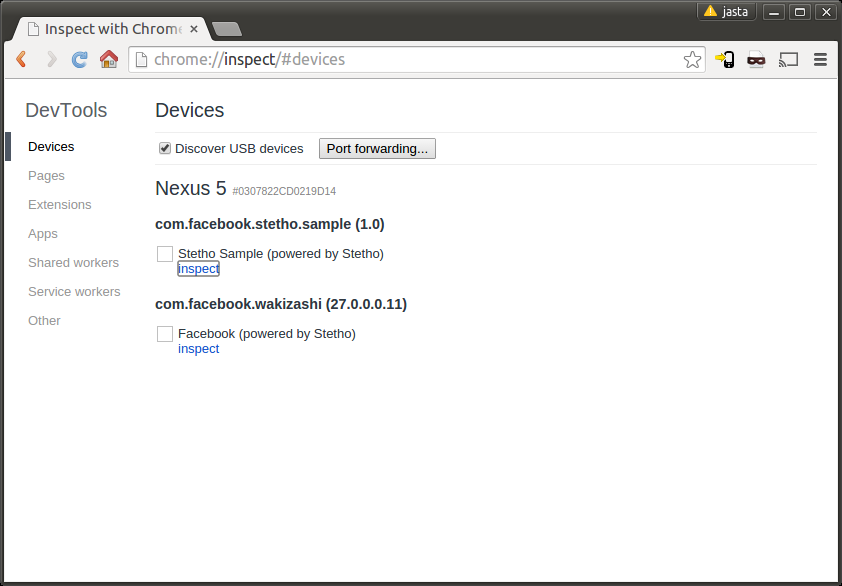
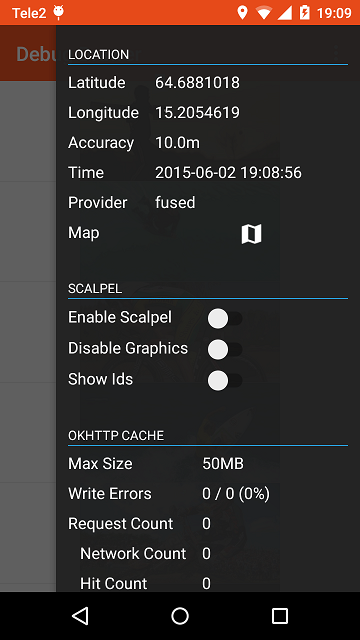
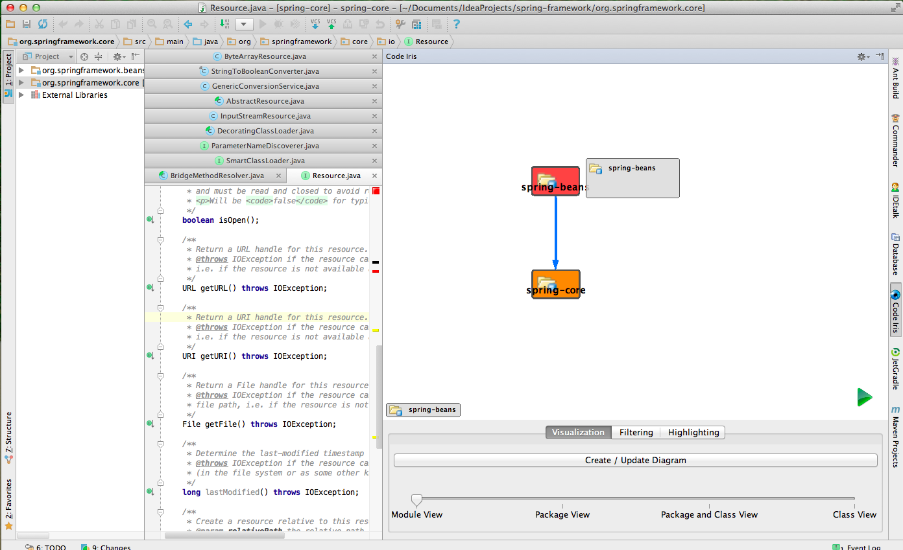
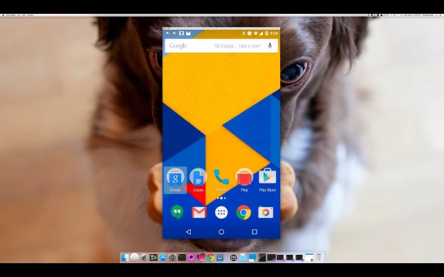
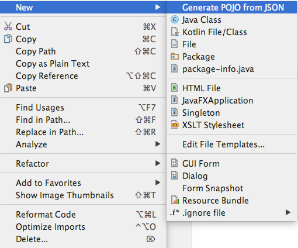
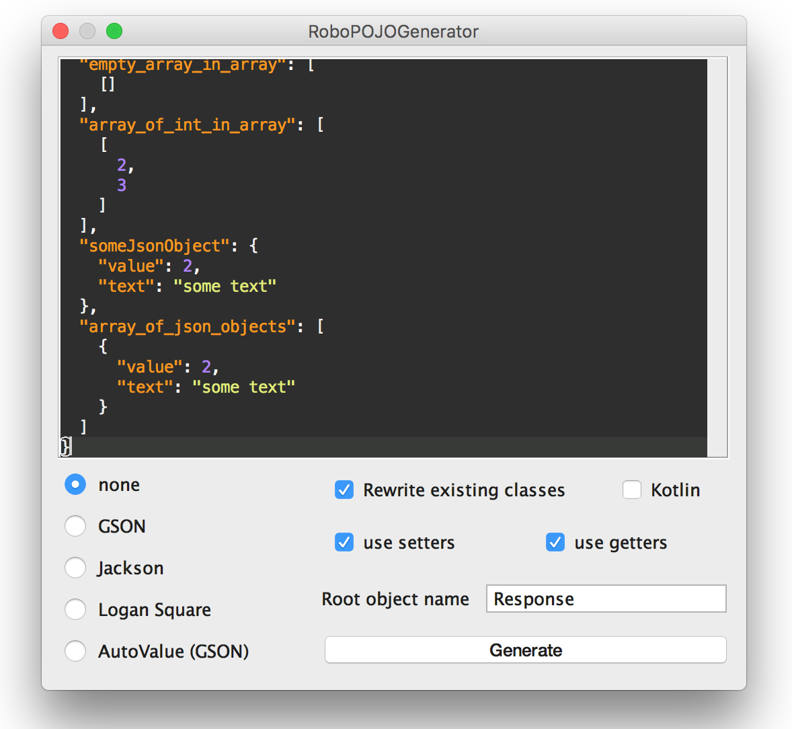
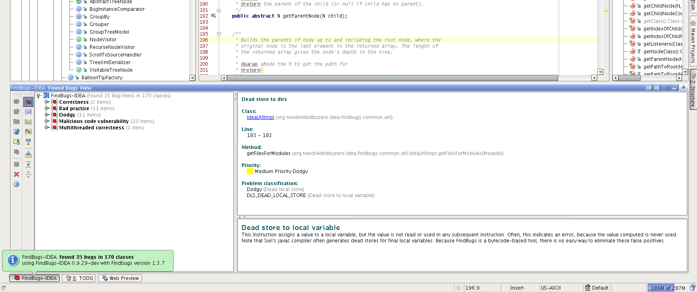

<!--
$theme: gaia
template: gaia
$size: 16:9
-->

Android utilities
===

# 

###### by [Romain Rochegude](https://github.com/RoRoche)

---
<!-- page_number: true -->

# App debugging

<http://facebook.github.io/stetho/>




---

<https://github.com/palaima/DebugDrawer>



---

# Memory leaks detection

<https://github.com/square/leakcanary/>


---

# Javadoc generation

<https://github.com/vanniktech/gradle-android-javadoc-plugin>

```groovy
buildscript {
    repositories {
        mavenCentral()
    }
    dependencies {
        classpath 'com.vanniktech:gradle-android-javadoc-plugin:0.2.1'
    }
}

apply plugin: 'com.vanniktech.android.javadoc'
```

---

# Plantuml diagram generation

<http://plantuml.com/javadoc>

# 

* put `plantuml.jar`into `libs/` folder
* run `java -jar libs/plantuml.jar src/**.java`

---

# Project source code overview

<https://plugins.jetbrains.com/idea/plugin/7324-code-iris>



---

# Bug tracking

<https://get.fabric.io/>


---

# App demonstration

<https://www.vysor.io/>



---

# Driver installer

<http://adbdriver.com/>

---

# GoogleIt

<https://plugins.jetbrains.com/plugin/7402-googleit>

---

# POJO generator

<https://github.com/robohorse/RoboPOJOGenerator>




---

# App quality

<https://plugins.jetbrains.com/plugin/4594-qaplug>
<https://plugins.jetbrains.com/plugin/3847-findbugs-idea>



---

# Semantic versionning

<https://github.com/ethankhall/gradle-semantic-versioning>
<https://github.com/vivin/gradle-semantic-build-versioning>
<https://medium.com/@maxirosson/versioning-android-apps-d6ec171cfd82>
<http://droidmentor.com/versioning-an-android-app-how-and-why/>

> Given a version number MAJOR.MINOR.PATCH, increment the:
> MAJOR version when you make incompatible API changes,
> MINOR version when you add functionality in a backwards-compatible manner, and
> PATCH version when you make backwards-compatible bug fixes.

---

# Proguard utilities

<https://github.com/krschultz/android-proguard-snippets>

---

# Project configuration

https://github.com/zsoltk/paperwork>

```groovy
buildscript {
    // ...
    dependencies {
        classpath 'hu.supercluster:paperwork-plugin:1.2.7'
    }
}

apply plugin: 'hu.supercluster.paperwork'

paperwork {
    // Configuration comes here, see next section for details
}

dependencies {
    compile 'hu.supercluster:paperwork:1.2.7'
}
```

---

# Logo credits

Tools graphic by <a href="http://www.flaticon.com/authors/pixel-perfect">pixel_perfect</a> from <a href="http://www.flaticon.com/">Flaticon</a> is licensed under <a href="http://creativecommons.org/licenses/by/3.0/" title="Creative Commons BY 3.0">CC BY 3.0</a>. Check out the new logo that I created on <a href="http://logomakr.com" title="Logo Maker">LogoMaker.com</a> https://logomakr.com/7yeDlk7yeDlk