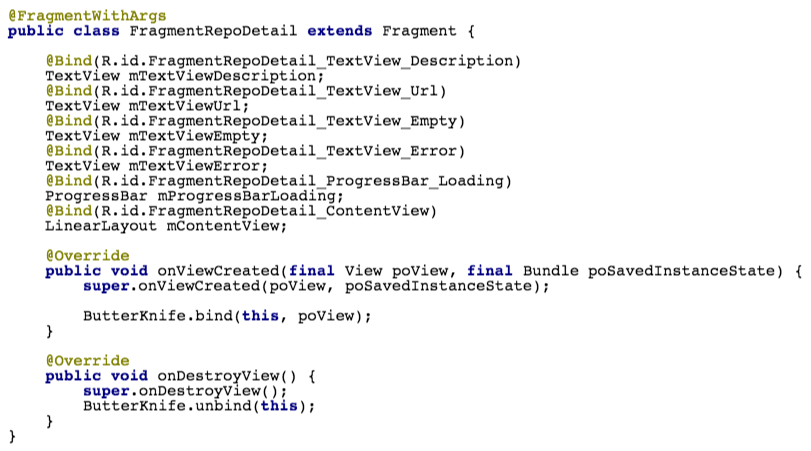
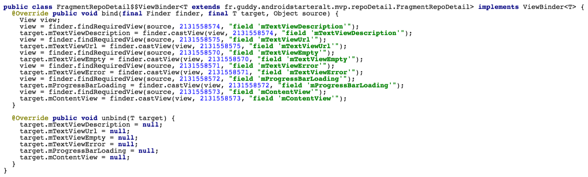
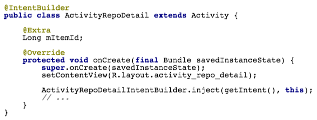
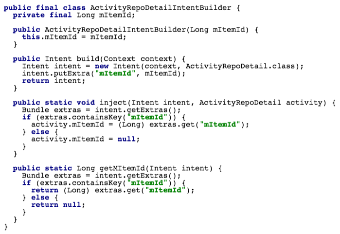
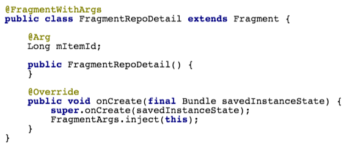
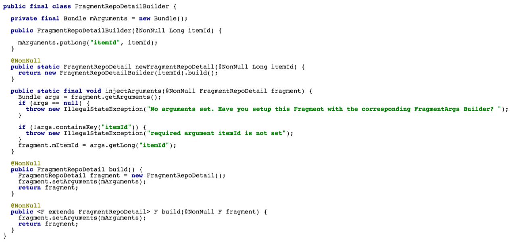
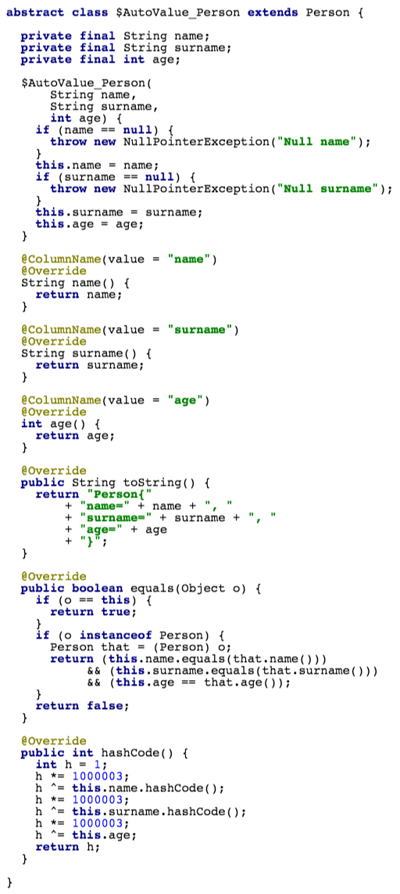
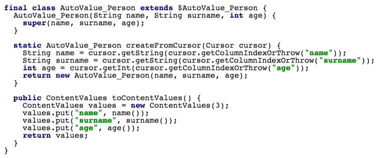

# Introduction

## Introduction

* Gain of productivity
    * Don't (re)write boilerplate code
    * Automatic code generation
* Code quality improvements
    * Widely tested and documented third-party libraries
    * Less code to write, less bugs to fix
* What about performances?
    * Annotations processing compile time vs. runtime

# Android compliance

## Android compliance

* [android-apt plugin](https://bitbucket.org/hvisser/android-apt) for Android Studio
    * Allows developers to configure a compile time annotation processor as a dependency in the `build.gradle` file
    * Runs annotation processing
    * Example:

```groovy
dependencies {
    compile 'a.group:annotation:x.x.x'
    apt 'a.group:processor:x.x.x'
}
```

# Views

## [Butter Knife](http://jakewharton.github.io/butterknife/)

* No `findViewById` anymore, elegant binding mechanism
* Simple way to bind resources
* Bind anything: activities, fragments, views, view holders
* The power of view lists (actions, setters)

---

* Event bindings:
    * OnClick/OnLongClick, OnItemSelected, OnCheckedChanged, OnEditorAction, OnFocusChange, OnItemLongClick, OnPageChange, OnTextChanged, OnTouch

* Under the hood
    * Same package binding class generation
    * A single entry point: the `ButterKnife` class, that resolves the concrete binder

---



---



# Navigation

## [IntentBuilder](https://github.com/emilsjolander/IntentBuilder) and [FragmentArgs](https://github.com/sockeqwe/fragmentargs)

* Problem:
    * Boilerplate and unsafe code to declare a new screen
* Solution:
    * Annotations to declare an Activity/Fragment
    * Annotations to declare (optional) parameter(s) to pass
    * Class generation following the [Builder pattern](http://www.oodesign.com/builder-pattern.html)
    * Method to inject parameter(s) in the target class

---



---



---



---



# Interactions

## [AutoValue: Cursor Extension](https://github.com/gabrielittner/auto-value-cursor)

* Abstract class with the `@AutoValue` to define POJO
* Simple `@ColumnName` to define the binding between column names and class fields

---

```java
@AutoValue
public abstract class Person {
 @ColumnName("name") abstract String name();

 public static Person create(Cursor cursor) {
  return AutoValue_Person.
          createFromCursor(cursor);
 }

 abstract ContentValues toContentValues();
}
```

---



---



# Others

## Others

* ORM: [requery](https://github.com/requery/requery)

* JSON parsing: [LoganSquare](https://github.com/bluelinelabs/LoganSquare)

* Bus: [EventBus](https://github.com/greenrobot/EventBus)

* Saving and restoring instance state: [Icepick](https://github.com/frankiesardo/icepick)

* Easily deal with the result from an activity started for result: [OnActivityResult](https://github.com/vanniktech/OnActivityResult)

* and so on: <http://android-arsenal.com/tag/166>

# Write custom annotation processors

## Concepts

* Provide a robust annotation API

* Implement the algorithm to search for your annotations and deal with it

---

## Generate Java source files: [JavaPoet](https://github.com/square/javapoet)

* Powerful and complete API to describe 
    * static imports,
    * classes, interfaces, enums, anonymous inner classes,
    * fields, parameters, variables,
    * methods, constructors,
    * annotations, javadoc

* Specific wildcards to format the output code 

* Test generated files with Google's _[Compile Testing](https://github.com/google/compile-testing)_ and _[Truth](https://google.github.io/truth/)_

---

```java
MethodSpec main = MethodSpec
  .methodBuilder("main")
  .addModifiers(Modifier.PUBLIC, 
                    Modifier.STATIC)
  .returns(void.class)
  .addParameter(String[].class, "args")
  .addStatement("$T.out.println($S)", 
                    System.class, 
                    "Hello, JavaPoet!")
  .build();
```

---

to

```java
public static void main(String[] args) {
    System.out.println("Hello, JavaPoet!");
}
```

---

### A must-read article: [ANNOTATION PROCESSING 101
by Hannes Dorfmann](http://hannesdorfmann.com/annotation-processing/annotationprocessing101)

# Conclusion

## Conclusion

* Performance: machine and/or human

* Readable

* Maintainable

